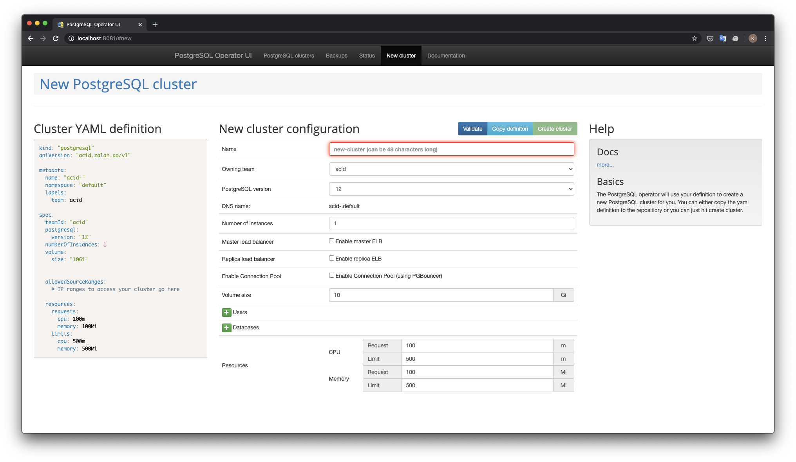

# [name]

Git Repository: [GitHub - zalando/postgres-operator: Postgres operator creates and manages PostgreSQL clusters running in Kubernetes](https://github.com/zalando/postgres-operator)
Getting Started: [postgres-operator/quickstart.md at master · zalando/postgres-operator · GitHub](https://github.com/zalando/postgres-operator/blob/master/docs/quickstart.md)

その他参考リンク

- [Postgres on Kubernetes with the Zalando operator](https://vitobotta.com/2020/02/05/postgres-kubernetes-zalando-operator/?utm_sq=gf5wswy27v)

## どんなもの?

k8s 上に PostgreSQL クラスタを構築するためのオペレータ

## 特徴

比較してないのでわかりません…(TODO)

## 周辺知識

- [GitHub - operator-framework/operator-lifecycle-manager: A management framework for extending Kubernetes with Operators](https://github.com/operator-framework/operator-lifecycle-manager)
  - 使わずに helm でインストールしたが、こんなのもあるのか…
- [OperatorHub.io \| The registry for Kubernetes Operators](https://operatorhub.io/)
  - はじめてみた。

## 動かす

### オペレータをデプロイ

```
git clone https://github.com/zalando/postgres-operator.git
cd postgres-operator
```

```
$ helm install postgres-operator ./charts/postgres-operator
manifest_sorter.go:192: info: skipping unknown hook: "crd-install"
manifest_sorter.go:192: info: skipping unknown hook: "crd-install"
NAME: postgres-operator
LAST DEPLOYED: Sat Jun 20 02:11:58 2020
NAMESPACE: default
STATUS: deployed
REVISION: 1
TEST SUITE: None
NOTES:
To verify that postgres-operator has started, run:

  kubectl --namespace=default get pods -l "app.kubernetes.io/name=postgres-operator"
```

コマンドにでている通りオペレータがデプロイされているかを確認する。

```
$ kubectl --namespace=default get pods -l "app.kubernetes.io/name=postgres-operator"
NAME                                 READY   STATUS    RESTARTS   AGE
postgres-operator-69fbb5684d-md9fd   1/1     Running   0          26s
```

動いていそう。

### UI をデプロイ

```
$ helm install postgres-operator-ui ./charts/postgres-operator-ui
NAME: postgres-operator-ui
LAST DEPLOYED: Sat Jun 20 02:19:01 2020
NAMESPACE: default
STATUS: deployed
REVISION: 1
TEST SUITE: None
NOTES:
To verify that postgres-operator has started, run:

  kubectl --namespace=default get pods -l "app.kubernetes.io/name=postgres-operator-ui"
```

こっちも動作確認する。

```
$ kubectl --namespace=default get pods -l "app.kubernetes.io/name=postgres-operator-ui"
NAME                                    READY   STATUS    RESTARTS   AGE
postgres-operator-ui-656d64b458-zbfdt   1/1     Running   0          29s
```

動いてそう。

kind なのでポートフォワードしたあとに `localhost:8081` にアクセスする。

```
$ kubectl get svc
NAME                   TYPE        CLUSTER-IP      EXTERNAL-IP   PORT(S)    AGE
kubernetes             ClusterIP   10.96.0.1       <none>        443/TCP    15m
postgres-operator      ClusterIP   10.100.135.10   <none>        8080/TCP   8m11s
postgres-operator-ui   ClusterIP   10.100.96.117   <none>        8081/TCP   68s
$ postgres-operator % kubectl port-forward svc/postgres-operator-ui 8081:8081
Forwarding from 127.0.0.1:8081 -> 8081
Forwarding from [::1]:8081 -> 8081
```



### Posgres cluster を作成

```
kubectl create -f manifests/minimal-postgres-manifest.yaml
```

```
$ kubectl get postgresql
NAME                   TEAM   VERSION   PODS   VOLUME   CPU-REQUEST   MEMORY-REQUEST   AGE   STATUS
acid-minimal-cluster   acid   12        2      1Gi                                     73s   Running
```

```
$ kubectl get pods -l application=spilo -L spilo-role
NAME                     READY   STATUS    RESTARTS   AGE   SPILO-ROLE
acid-minimal-cluster-0   1/1     Running   0          97s   master
acid-minimal-cluster-1   1/1     Running   0          60s   replica
```

```
$ kubectl get svc -l application=spilo -L spilo-role
NAME                          TYPE        CLUSTER-IP      EXTERNAL-IP   PORT(S)    AGE    SPILO-ROLE
acid-minimal-cluster          ClusterIP   10.108.225.78   <none>        5432/TCP   118s   master
acid-minimal-cluster-config   ClusterIP   None            <none>        <none>     80s
acid-minimal-cluster-repl     ClusterIP   10.98.248.160   <none>        5432/TCP   118s   replica
```

正常にデプロイされた。

pod を見てみるとクラスタ用が 2 つたっているのがわかる。

```
$ kubectl get pods
NAME                                    READY   STATUS    RESTARTS   AGE
acid-minimal-cluster-0                  1/1     Running   0          3m13s
acid-minimal-cluster-1                  1/1     Running   0          2m36s
postgres-operator-69fbb5684d-md9fd      1/1     Running   0          15m
postgres-operator-ui-656d64b458-zbfdt   1/1     Running   0          8m27s
```

### psql で作成した Posgres cluster に接続

サービスを確認

```
$ kubectl get svc
NAME                          TYPE        CLUSTER-IP      EXTERNAL-IP   PORT(S)    AGE
acid-minimal-cluster          ClusterIP   10.108.225.78   <none>        5432/TCP   6m5s
acid-minimal-cluster-config   ClusterIP   None            <none>        <none>     5m27s
acid-minimal-cluster-repl     ClusterIP   10.98.248.160   <none>        5432/TCP   6m5s
kubernetes                    ClusterIP   10.96.0.1       <none>        443/TCP    25m
postgres-operator             ClusterIP   10.100.135.10   <none>        8080/TCP   18m
postgres-operator-ui          ClusterIP   10.100.96.117   <none>        8081/TCP   11m
```

~~別タブを開いて `acid-minimal-cluster` の `5432` 番ポートにポートフォワードする。~~

と思ったが、[User Guide]](https://github.com/zalando/postgres-operator/blob/master/docs/user.md#connect-to-postgresql)によると pod に直接ポートフォワードしているっぽい。

```
# get name of master pod of acid-minimal-cluster
$ export PGMASTER=$(kubectl get pods -o jsonpath={.items..metadata.name} -l application=spilo,cluster-name=acid-minimal-cluster,spilo-role=master)
$ kubectl port-forward $PGMASTER 6432:5432
zsh: command not found: #
zsh: command not found: #
Forwarding from 127.0.0.1:6432 -> 5432
Forwarding from [::1]:6432 -> 5432
```

secret の取得方法がドキュメントと少し違った。

```
$ export PGPASSWORD=$(kubectl get secret postgres.acid-minimal-cluster.credentials.postgresql.acid.zalan.do -o 'jsonpath={.data.password}' | base64 -d)
$ export PGSSLMODE=require
$ psql -U postgres -p 6432 -h localhost
psql (12.3, server 12.2 (Ubuntu 12.2-2.pgdg18.04+1))
SSL connection (protocol: TLSv1.3, cipher: TLS_AES_256_GCM_SHA384, bits: 256, compression: off)
Type "help" for help.

postgres=#
```

動いた!! 🐘

もう少しちゃんと触っているブログ記事もありますが、今日はここまで…

- [Postgres on Kubernetes with the Zalando operator](https://vitobotta.com/2020/02/05/postgres-kubernetes-zalando-operator/?utm_sq=gf5wswy27v)
